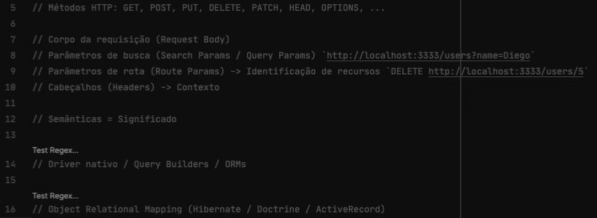
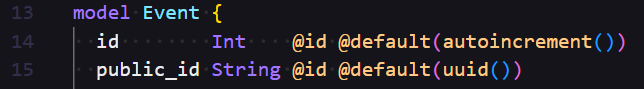

#### Iniciar
`npm init -y`

#### Instalar o Typescript
`npm i typescript @types/node -D`

#### Iniciar o Typescript
`npx tsc --init`

#### Padrão de tsconfig para essa versão do node
https://github.com/tsconfig/bases
na versão Node 20, abrir o arquivo "tsconfig.json" e atualizar seu tsconfig.json

#### Incluir no tsconfig
`"include": ["src"] no tsconfig`

#### É para executar e converter o arquivo .ts para .js
`npx tsc`

#### Instalar a dependencia para conversão automática do ts para js
`npm i tsx -D`

#### Usando o tsx (converte o ts para js e já executa o js no terminal)
`npx tsx src/server.ts`

#### Idem o de cima, mas sempre monitorando alterações no arquivo
`npx tsx watch src/server.ts`

#### Incluir no packege.json o script dev
`tsx watch src/server.ts`

#### E executar
`npm run dev`

#### Instalando o Fastify
`npm i fastify`

#### Instalando o ORM Prisma
`npm i prisma -D`

#### Iniciando o banco de dados de arquivo local SQLite
`npx prisma init --datasource-provider SQLite`

#### Pra criar um public_id como UUID e um id incremental para performance e relacionamentos no banco

#### Ao criar a tabela, rodar:
`npx prisma migrate dev`
created table events

#### Acessa o banco de dados pelo prisma
`npx prisma studio`

#### Instalar a extensão REST Client e criar na raiz um arquivo .http
api.http

#### Instalar o zod para fazer validação
npm i zod

